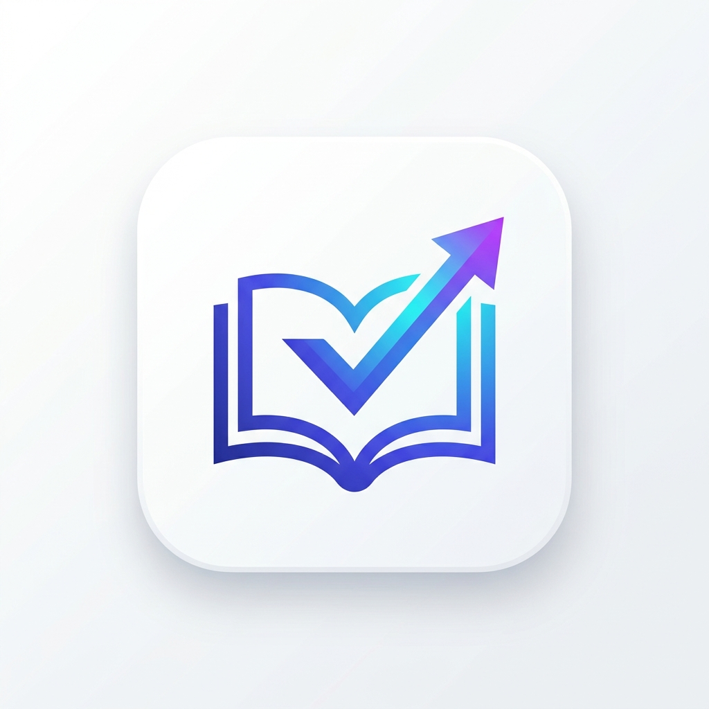

# UniTask - Agenda Universitaria Cifrada 🎓📅🔒

  

**UniTask** es un gestor interactivo de entregas, exámenes y plazos académicos para estudiantes universitarios. Integra un sistema de **autenticación de usuarios**, **base de datos local en el navegador (IndexedDB)** y **cifrado criptográfico de grado militar (AES-256-GCM y PBKDF2)** de cero conocimiento (*zero-knowledge encryption*).

---

## 🚀 Demo en Vivo

🌐 Accede directamente sin instalar nada: **[https://rodalca03.github.io/uni-tasker/](https://rodalca03.github.io/uni-tasker/)**

---

## 🔐 Seguridad, Cifrado y Sincronización en la Nube
 
- **Autenticación Segura & Multi-dispositivo**: Crea tu cuenta y accede desde tu ordenador o teléfono móvil con sincronización en tiempo real.
- **Cifrado AES-256-GCM Cliente (Zero-Knowledge)**: Todas tus tareas, asignaturas y fechas se encriptan con la Web Crypto API en tu propio navegador antes de enviarse a la base de datos o a la nube.
- **Derivación de Claves PBKDF2**: Claves criptográficas derivadas con 100,000 iteraciones SHA-256 y sal criptográfica de 128 bits.
- **Base de Datos Híbrida (Local-First + Firebase Firestore)**:
  - Funciona de manera 100% offline y local en IndexedDB.
  - Al conectar tu proyecto de **Google Firebase Firestore**, tus cuentas y datos se sincronizan automáticamente entre todos tus dispositivos.
  - **Privacidad Absoluta**: Google Firebase solo almacena datos cifrados e identificadores matemáticos; nunca ve tus tareas en texto plano ni tus contraseñas.
- **📲 Enlace de Sincronización en 1 Clic**: Genera un enlace cifrado para vincular tu teléfono móvil al instante sin tener que escribir configuraciones complejas en la pantalla táctil.

---

## ✨ Características y Funcionalidades

- 📱 **Diseño Mobile Responsive & Touch-First**:
  - Selector deslizante de días de la semana con indicadores de tareas.
  - Conmutador de vista táctil: **Por Día** o **Semana Completa**.
  - Botón flotante (**FAB**) para crear tareas con una sola mano.
  - Modales fluidos estilo *bottom-sheet* en teléfonos móviles.

- 🗓️ **Tablero Semanal**:
  - Navegación ágil entre semanas y salto inmediato a "Hoy".
  - Barra de progreso que calcula el porcentaje de cumplimiento semanal.
  - Prioridades visuales: 🔴 Alta, 🟡 Media, 🟢 Baja.

- 🎨 **Gestión de Asignaturas**:
  - Colores personalizados por materia.
  - Reasignación de tareas al eliminar una asignatura.
  - Filtro instantáneo por asignatura.

---

## 🛠️ Tecnologías

- **HTML5 & CSS3** con diseño adaptativo.
- **Web Crypto API** nativa del navegador (`crypto.subtle`).
- **IndexedDB** para persistencia estructurada local.
- **Tailwind CSS** (vía CDN) & **Google Fonts** (Plus Jakarta Sans).
